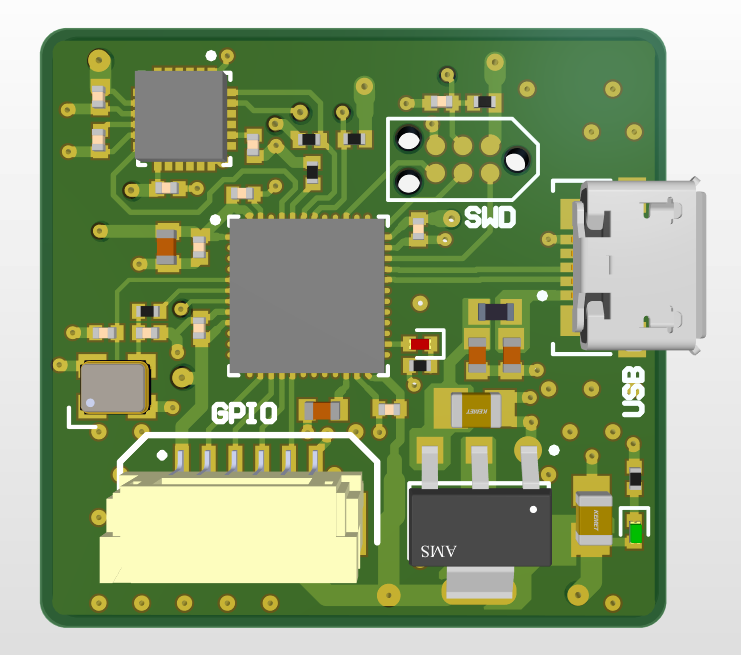
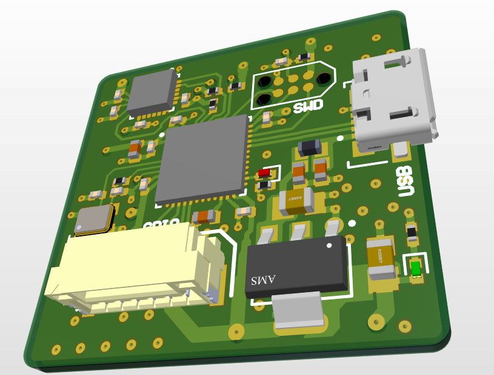
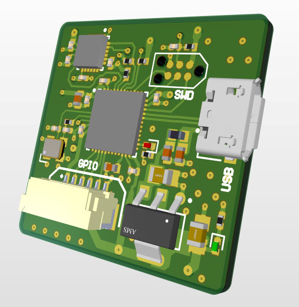

# STM32 Breakout Board
This is a simple STM32F4 based Breakout board that contains;
- The STM32F411 circuitry
- The MPU-6050 sensor circuitry
- USB and Power supply circuitry
- SWD Circuitry

This was a guided project in my learning process.

## Final Board

